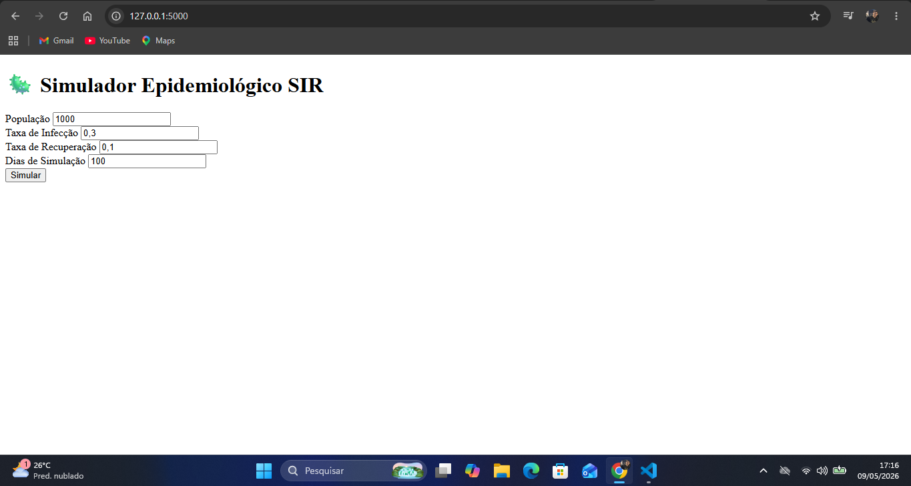

# 🦠 Epidemic Simulator - Modelo SIR com Flask

Este projeto é uma aplicação web educacional que simula a propagação de doenças infecciosas utilizando o modelo epidemiológico SIR (Suscetíveis-Infectados-Recuperados).

A ferramenta permite visualizar a evolução de uma epidemia de forma interativa, ajustando parâmetros como taxa de infecção, recuperação e população inicial.

---

## 🚀 Tecnologias utilizadas

- Python
- Flask
- HTML5 + CSS3
- Matplotlib

---

## 📊 Modelo SIR

O modelo divide a população em três grupos:

- S(t): Suscetíveis  
- I(t): Infectados  
- R(t): Recuperados  

### Equações do modelo:

$$
\frac{dS}{dt} = -\beta \frac{SI}{N}
$$

$$
\frac{dI}{dt} = \beta \frac{SI}{N} - \gamma I
$$

$$
\frac{dR}{dt} = \gamma I
$$

---

## 🎯 Funcionalidades

- Simulação da propagação de doenças
- Ajuste de parâmetros:
  - População inicial
  - Taxa de infecção (β)
  - Taxa de recuperação (γ)
  - Número de dias
- Geração de gráfico SIR em tempo real

---

## 🖥️ Interface

### Tela inicial


### Resultado da simulação


---

## ⚙️ Como executar

```bash
git clone https://github.com/luquetaaasn/epidemic-simulator
cd epidemic-simulator
pip install -r requirements.txt
python app.py